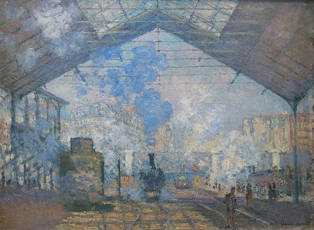
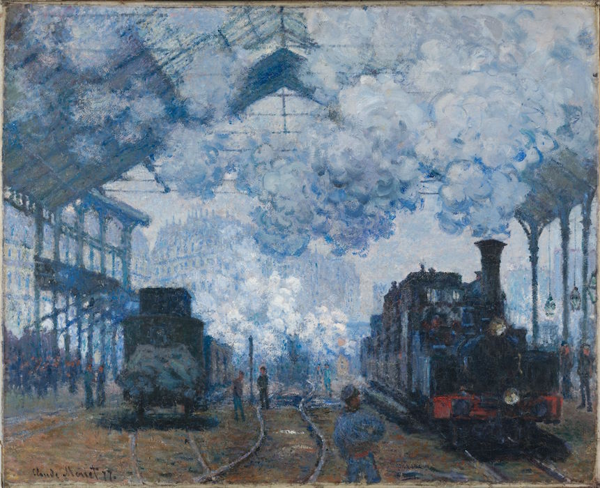

# 9103_tut7_quiz8
I think the imaging technique of the Impressionism will inspire for my assignment. The Impressionist painting style creates a strong colour vibration effect by capturing the changes in sunlight, and brings the emotional effect of the painting through visual impact. This means that in my coding work, I need to depict the flow of the artwork and the change of colour to express the visual impact. Among them, I will focus on the specific presentation of the Impressionist light and shadow processing on smoke and clouds.

To express the flow of smoke and clouds, the coding technique of smoke particles in p5.js can meet this effect. When the user moves the mouse, the flow direction and light effects of smoke and clouds will change with the movement of the mouse. Based on the preloaded particle image, this coding technique will draw the arrow and set the direction to present the wind force, and set the lifespan of the particles to create the effect of the smoke tail disappearing.

[Coding Example](https://p5js.org/examples/simulate-smokeparticles.html)